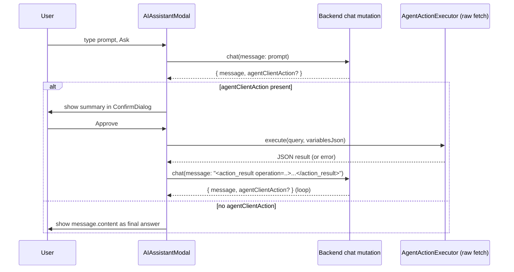

# Client Plan: Agent Client Action + Chaining (handoff from racquetleague backend)

Status: plan only, not yet implemented. Written for racquetleague-ui.

## Background

The backend (`racquetleague`) `chat` mutation can now return an `agentClientAction` alongside (or instead of) a normal assistant `message`:

```graphql
type AgentClientAction {
  operationName: String!
  query: String!       # full GraphQL document text, mechanically generated server-side
  variables: String!   # JSON string of the variables map
  summary: String!     # LLM-authored, plain-language description for approval UI
}

type ChatResponse {
  error: String
  message: ChatMessage
  suggestedEvents: [SuggestedEvent!]
  agentClientAction: AgentClientAction
}
```

- `agentClientAction` is a **proposal**, not an executed result. The backend never runs it. It is scoped to the exact same GraphQL schema/permissions the client already has (via cookie session) — nothing new to authorize.
- `query`/`variables` are safe to execute as-is: they're built server-side from the live schema (field/arg names only, args passed as `$variables`, never string-interpolated), but the **client must still show `summary` and get explicit user approval before executing**, since these can be arbitrary mutations (e.g. `leaveEvent`, `createEvent`, etc.), not just reads.
- The backend has no multi-step loop. **The client owns the loop**: execute the approved action, send the result back as the next `chat` message (wrapped in a documented envelope described below), and repeat until a response comes back with no `agentClientAction`. The backend's system prompt already expects this envelope format (see "Result envelope" below) and is written to propose at most one action per turn and use the returned result to decide the next step or give a final answer.
- The backend also now persists the assistant's own final text turns (previously it silently dropped them when no tool was called), so conversation memory across turns works correctly on the backend side — nothing the client needs to do for that.

## Result envelope (contract with the backend system prompt)

After executing an approved action, send the result back through the **same `chat` mutation**, as a normal user message string, formatted as:

```
<action_result operation="joinEvent">{"data":{"joinEvent":{...}}}</action_result>
```

- `operation` = the `operationName` from the `agentClientAction` you just executed.
- Body = compact JSON of the GraphQL response (the whole `{data, errors}` envelope, or just `data`/`errors` — recommend passing through the raw fetch response JSON as-is for the model to interpret, but see "Payload size" below).
- On a GraphQL error (network error or `errors` in the response), still send an `<action_result>` wrapping the error so the model can react (e.g. propose a corrected action or explain the problem to the user) rather than silently failing.

The backend does not parse this string — it's a convention the system prompt is aware of, so no backend coordination is needed if the exact tag name ever needs to change on the client (though changing it should be coordinated since the prompt hardcodes `<action_result operation="...">`).

## Existing pieces to build on

- **[src/components/organisms/AIAssistantModal.res](../src/components/organisms/AIAssistantModal.res)** — the current single-shot AI assistant modal. Uses a `%relay` compiled mutation:
  ```
  module ChatMutation = %relay(`
    mutation AIAssistantModalChatMutation($input: ChatInput!) {
      chat(input: $input) { message { content messageType } suggestedEvents { ... } error }
    }
  `)
  ```
  `chatMutate(~variables={input: {message: prompt}}, ~onCompleted, ~onError)`. No `sessionId` is passed — the backend derives the session from the authenticated user, so repeated calls to this same mutation already continue the same conversation server-side. This is the natural place to add the loop.
- **[server/NetworkUtils.res](../server/NetworkUtils.res)** (`makeFetchQuery`, ~L189) — shows the exact fetch shape Relay itself uses to talk to the backend: `POST /graphql`, `credentials: "include"`, `body: {query: operation.text, variables}`. This is the pattern the new **generic executor** (below) should mirror, since it's already proven to carry the user's session cookie correctly.
- **[src/entry/RelayEnv.res](../src/entry/RelayEnv.res)** — Relay environment/network setup; confirms cookie-based auth (`credentials: "include"`), no bearer token to worry about.
- **[src/components/molecules/ConfirmDialog.res](../src/components/molecules/ConfirmDialog.res)** — existing reusable `title`/`description`/`onConfirmed`/`isOpen` confirm dialog (wraps `Alert`). Use this (or the pattern it establishes) for the action-approval dialog — pass `agentClientAction.summary` as the description.
- **[src/components/shared/AITypes.res](../src/components/shared/AITypes.res)** — shared `aiResponse` type used by the modal; will need a new field for the pending action.

## Why NOT use Relay's compiled `%relay` queries for the proposed action itself

`agentClientAction.query` is generated dynamically per-turn on the backend — it can't be known at build time, so `relay-compiler` can't generate a typed document for it. Executing it must bypass Relay's compile-time query system. Since Relay's own network layer (`NetworkUtils.makeFetchQuery`) is *just* a raw `fetch` POST of `{query, variables}` with `credentials: "include"`, the simplest and most consistent approach is: **write a small standalone async function that does the same raw fetch**, independent of Relay's store/cache. This intentionally does NOT go through Relay's normalized cache — see "Relay cache staleness" under Further Considerations.

## Steps

### Phase 1: Generic GraphQL action executor (new, small, no Relay compiler involvement)
1. New module, e.g. `src/lib/AgentActionExecutor.res` (or alongside `NetworkUtils.res` if cross-cutting): a function
   ```
   let execute: (~query: string, ~variablesJson: string) => promise<result<Js.Json.t, string>>
   ```
   that:
   - `JSON.parse`s `variablesJson` into the variables object (the field is a JSON *string* from the backend, per `AgentClientAction.variables: String!`).
   - POSTs to the same endpoint Relay uses (`dev ? apiEndpoint : "/graphql"`, or simply `/graphql` in the browser) with `credentials: "include"`, `content-type: application/json`, body `{query, variables}`.
   - Parses the JSON response; returns `Ok(json)` on success (even if the GraphQL response contains an `errors` array — pass the whole envelope through, let the caller/model see it) or `Error(message)` on network failure.
2. No Relay cache write here for MVP (see Further Considerations #1).

### Phase 2: Extend the chat mutation + response type
3. In `AIAssistantModal.res`'s `ChatMutation`, add the `agentClientAction { operationName query variables summary }` selection to the mutation body.
4. Extend `AITypes.res` (or a new `AITypes.pendingAction` type) with a field to hold the pending action:
   ```
   type pendingAction = {
     operationName: string,
     query: string,
     variablesJson: string,
     summary: string,
   }
   ```
   Add `pendingAction: option<pendingAction>` to `aiResponse`, or track it as separate component state (`(pendingAction, setPendingAction) = React.useState(...)`) — separate state is simpler since it's transient UI state, not part of the persisted response summary.

### Phase 3: Approval UI + execute-and-continue loop
5. In `AIAssistantModal.res`'s `onCompleted` handler: if `chatResponse.agentClientAction` is present, set it as the pending action (don't treat `message.content` as the final answer — see Further Considerations #2 re: placeholder text) and show a `ConfirmDialog` with `title="Approve action"` and `description=agentClientAction.summary`.
6. On confirm: call `AgentActionExecutor.execute(~query, ~variablesJson=variables)`, then regardless of success/failure, build the envelope string `<action_result operation="${operationName}">${jsonBody}</action_result>` and call `chatMutate(~variables={input: {message: envelope}}, ~onCompleted, ~onError)` again — reusing the exact same completion handler recursively, so a chain of proposed actions "just works" without new plumbing.
7. On cancel/deny: do NOT call `chat` again automatically. Simplest MVP: just clear the pending action and let the user type a new message (effectively abandoning that proposal). Optionally send back `<action_result operation="...">{"cancelled": true}</action_result>` so the model knows the user declined, instead of silently going quiet — recommend this for better UX (model can acknowledge and suggest alternatives) but it's optional for MVP.
8. Client-owned loop guard: track a step counter per "ask" (reset on `handleReset`/new prompt); cap at e.g. 5 chained proposals in a row before forcing a stop with a message like "Too many steps, please continue manually" — prevents runaway loops if the model keeps proposing.
9. Loading state: keep `isLoading` true through the whole chain (propose → approve → execute → send result → next response), not just the initial ask, so the UI doesn't look idle mid-chain.

### Phase 4: Display polish
10. Render `agentClientAction` proposals distinctly from normal assistant replies (e.g. a card with the summary + Approve/Deny buttons, using `ConfirmDialog` or an inline variant) rather than showing the raw placeholder text the backend puts in `message.content` for propose-turns ("Proposed action generated for ... Awaiting user approval..."). Prefer showing `agentClientAction.summary` as the user-facing text for that turn instead of `message.content`.
11. When the loop finishes (a response has no `agentClientAction`), show `message.content` as the final answer, same as today.

## Data flow



## Verification
1. Manual: ask something that maps to a specific tool (join/leave/create event) — confirm existing behavior is unchanged (no `agentClientAction` involved, those still execute server-side directly per the current tools).
2. Manual: ask something that requires `propose_graphql_operation` (e.g. something not covered by the specific tools) — confirm:
   a. `agentClientAction` arrives with a valid `operationName`/`query`/`variables`/`summary`.
   b. Approval dialog shows `summary`.
   c. On approve, `AgentActionExecutor.execute` posts to `/graphql` with cookies and gets a real result.
   d. The envelope round-trips through `chat` and the model gives a coherent final answer referencing the result (e.g. confirms the join succeeded).
3. Manual: deny an action — confirm no infinite loop, UI returns to idle/ready-for-new-prompt.
4. Manual: force a chain of 2+ proposed actions in one ask (e.g. "search for X then join the first result") if the model chains — confirm the step counter doesn't false-trigger and the loop terminates correctly when `agentClientAction` is finally absent.
5. Regression: existing `suggestedEvents` flow (bulk event creation) still works unchanged.

## Further Considerations
1. **Relay cache staleness.** Executing an approved mutation via raw fetch does not update Relay's local store, so any Relay-rendered views showing affected data (e.g. an event's RSVP list) may look stale until next navigation/refetch. MVP: accept this and let the user manually refresh, or trigger a targeted refetch of known-affected queries after specific `operationName`s (e.g. refetch event RSVPs after `joinEvent`/`leaveEvent`). Defer general-purpose cache invalidation.
2. **Propose-turn message text.** The backend's `message.content` on a propose-turn is a placeholder confirmation string, not meant for the user. The client should prefer showing `agentClientAction.summary` instead of `message.content` whenever `agentClientAction` is present.
3. **Payload size in the envelope.** Large GraphQL results bloat the model's context (backend caps history at 20 messages). Consider trimming the JSON sent back in `<action_result>` to just the fields relevant to confirming success (e.g. drop deeply nested/large arrays) rather than the full raw response.
4. **Denial follow-up.** Sending `{"cancelled": true}` back on deny (Phase 3 step 7) is optional polish — decide based on UX priorities.
5. **Multi-turn chat history UI.** The current modal is single-shot (no rendered message thread); chaining will produce several turns in quick succession. Consider whether to render each intermediate turn (propose → approve → result → next) or just show a single "..." loading state until the final answer — recommend the latter for MVP simplicity, since intermediate turns are mostly plumbing, not conversation the user needs to read.
6. **Existing `chatMessages(sessionId)` query** could be used later to hydrate full history if the modal is upgraded to a persistent multi-turn thread; not required for the chaining loop itself since the backend already maintains continuity server-side per user.
